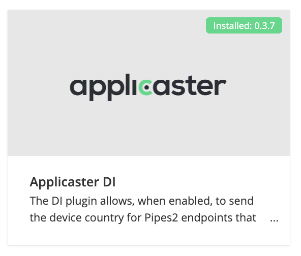

## How to setup geo block?

1. Add the Applicaster DI Plugin to your project
1. Add the geoblocking player to your app
1. Apply an [ISO 2 letter country code]() as Tag according to format. `geo:{iso2CountryCode}` on JW Player media items that are only available in specific country. E.g. `geo:NL`

Notes
- The video files (MP4) are still accessible at JW in other countries. This is not an issue as  JW URL signing is applied, so MP4 are only accessible to Applicaster apps.
- Do NOT enable to geo-block in JWplatform otherwise it will cause a conflict. See also [here]9https://docs.applicaster.com/integrations/jw-endpoints/#appendix-2---geo-blocking)
- The web app using standard JW geofiltering. See here: https://support.jwplayer.com/articles/set-geoblocking-rules-for-videos  

