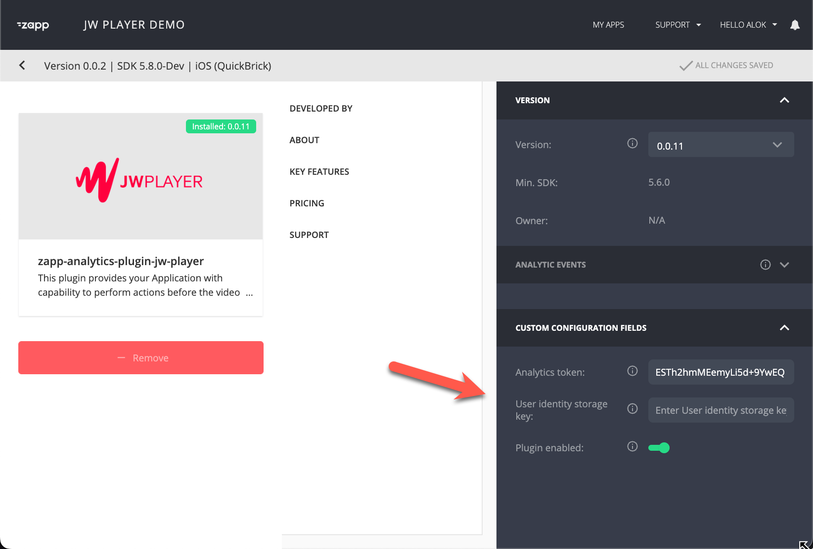

# Analytics
{: .no_toc}

- TOC
{:toc}

## How does JW Analytics work in Applicaster? 
Applicaster has a JW Analytics Plugin that feeds events to the [JW OTT Ping Interface](https://github.com/jwplayer/ott-web-app/blob/develop/docs/features/video-analytics.md)

The plugin sends 'pings' with video and device information to JW Player endpoint when
- Video has been loaded
- While a video is played (every x seconds)
- When an advertisement is shown

JW Player makes this data available throuh the JW Player dashboard, through the API and through export to and S3 bucket. See below.

## How to enable JW analytics in Applicaster?
The JW plugin needs to be enabled in Applicaster:
1. Retrieve the JW token from the JW account manager or solution engineer.
1. Add the JW Analytics plugin from the gallery
1. Insert the JW token provided by the JW AM/SE and save
1. Optional: Add the `User identity storage key` for tracking user level traffic (see below)
1. Build the app so the changes will take effect.

 *Applicaster uses the same analytics token for all platforms (iOS/Android etc.). 

## How to access analytics data? 
See [JW Player OTT App Analytics documentation](https://github.com/jwplayer/applicaster-docs/raw/main/OTT%20Apps%20Analytics.pdf)

## What data is available from Applicaster?
The metrics and dimension documented in the [OTT App Analytics documentation](https://github.com/jwplayer/applicaster-docs/raw/main/OTT%20Apps%20Analytics.pdf), except the following: 
- `ott_app_install_instance_id`: App install instance ID. Applicaster doesn't have an id that remains stable across installations. 
- `ott_device_firmware_version`: Firmware version of the OTT device.  
- `ott_device_model`: OTT Device Model number
- `ott_os_language`: Version of the OS on the OTT device.  
- `custom_parameter_name`
- `custom_parameter_value`

## How enable user level tracking (App User ID)? 
The applicaster plug can send the App User ID for play session data. This is can be used to analyze traffic per user, instead of per session. 

You need to have a proper the `User identity storage key` on the plugin. 

|Authentication provider|Setting|Example value |
|----------|--------------|----------------------|
|Cleeng|`quick-brick-login-flow.username`| user@mail.com |
|Oauth |`zapp_login_plugin_oauth_2_0.access_token` | eyJraWQiOiJEa1lUbmhTdkdT... |

For OAuth Applicaster can only share the access token. The access token is a [jwt](https://jwt.io/) provided by the Identity Provider. The token can be decoded and could include user information, depending on the identity provider configuration. 

Its also possible to match the JWT token to the userid using a data export from the identity system.

Note that the user level data is only accessible using the Play Sessions Data Export.

## Does Applicaster support other analytics systems?
Yes. See the Applicaster Plugin Directory in your account.
