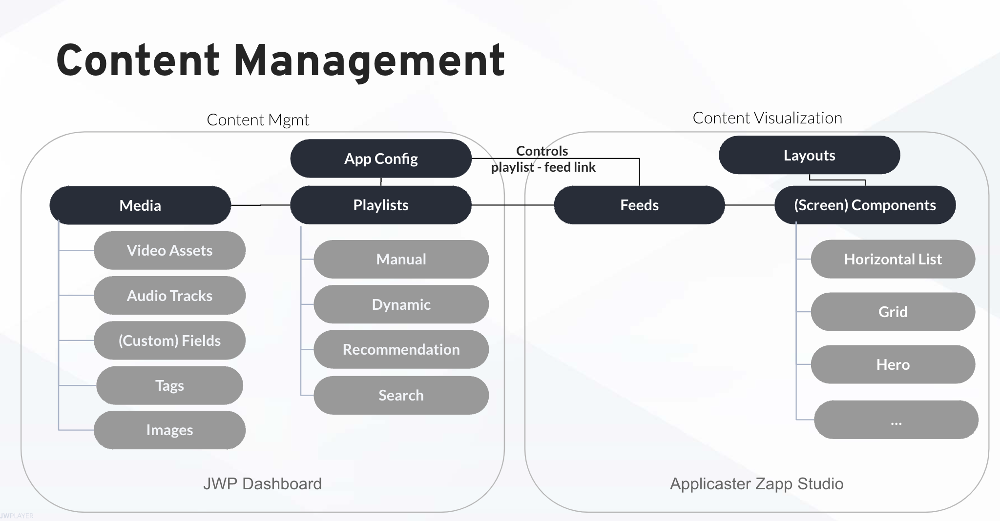

# Content Management 
{: .no_toc}

- TOC
{:toc}

## Overview

## Media
A video, including its 
- video assets: the video in different qualities, e.g 720p, 1080p, etc. 
- audio tracks: audio in different languages, or without music, etc. 
- images: thumbnails, additional images
- fields: title, description, genre, rating, actors, etc.  (customizable per type)
- geo rules
- tags

Details [here](https://docs.jwplayer.com/platform/docs/vdh-upload-videos)

## Playlists
A playlist is a collection of media items. There are several types of playlists. The following are relevant in combination with Applicaster:
- manual: manually curated lists. E.g. for a 'featured' shelf
- dynamic: automatically curated lists based on tags, and sorted on views or published data. 
- recommendations: creates a list of videos based on the video that a viewer watches
- search: creates a list of videos in your library based on a keyword search

Details [here](https://docs.jwplayer.com/platform/docs/vdh-playlist-overview)

## Components
A component is a UI entity that highlights a video or a list of videos. The UI representation of a component is flexible (e.g. grid, horizontal list, etc). 

The most used components are
- Grid: to show a list of video 
- Horizontal List: to show a list of videos in a horizontal row, a.k.a. a 'shelf'
- Hero: to highlight an individual video

Details [here](https://docs.applicaster.com/integrations/#how-zapp-apps-consume-data)

## Feeds
To be able to display the list of media it needs to access the data to render an item or list of items (e.g. its title, its description, its thumbnail and what screen to open). Feeds can be defined within Zapp Studio. The data on feeds comes from JW playlists. 

Details [here](https://docs.applicaster.com/integrations/#how-zapp-apps-consume-data)

## Layout
 Each layout consists of components, E.g. a rail with "Live now" and another rail with "Popular".  Each component gets JWP media from a JWP playlist through a feed.

## App config
The app config can control which playlist is linked to a feed. E.g. the playlist App Config position 1 is linked to feed A. Feed A  is linked to the top rail in a layout.

# Device-specific content
In Zapp, every platform links to a layout. E.g. Roku & Apple TV use the TV Layout and iOS uses the Mobile Layout.

# Geo-specific content
- Each media item in JWP can be linked to [geo blocking rules](https://docs.jwplayer.com/platform/docs/protection-set-geoblocking-rules-for-videos). 
- Media items are organized in the playlists.
- The JWP Delivery API filters content based on the end-user's country, based on the defined rules
- Applicaster Zapp will hide the complete rail when a playlist is completely empty. 

