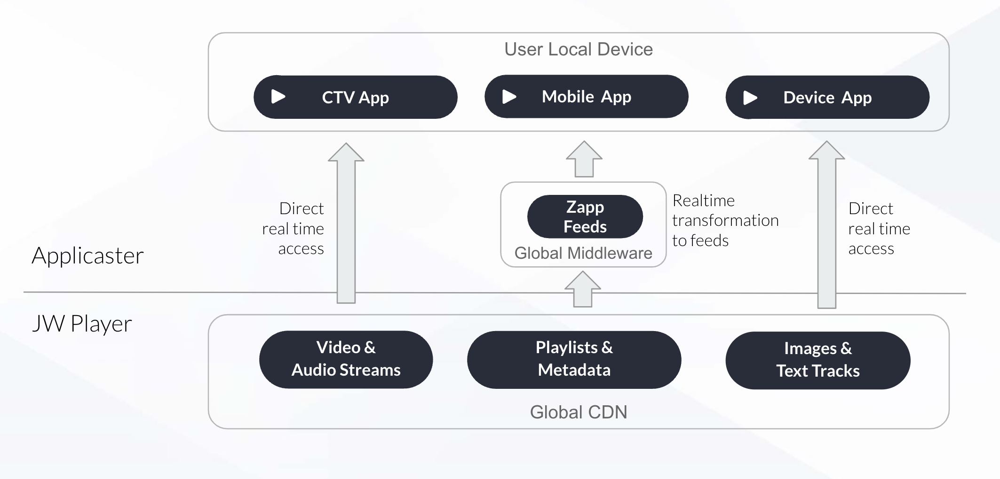

# Content Delivery 


<!--
Source file [here](https://docs.google.com/presentation/d/1K9hKSeJYY1nFBpW7GQUi7rbWmIYo4qJ_NIgOHzYUQHA/edit)
-->

## How do Zapp apps consume data from JW?
All Zapp apps on all platforms consume data from feeds. Feeds get data from JW Player endpoints

Applicaster has framework named Pipes2 that translates JW Player Delivery API into the feeds structure that Zapp apps can understand. 

This framework is a cloud middleware that its main purpose is to translate your content:
- Served on the cloud
- Written once to serve all our supported platforms
- Changes to Pipes2 are done remotely without needing to release a new version of the app
- Caching layer
- Monitoring tool to your API health.

## Zapp Feed Example
```
https://zapp-706-jw-player-demo.web.app/jw/playlists/ImeVuRDP
{
  "id": "ImeVuRDP",
  "title": "All Films",
  "type": {
    "value": "feed"
  },
  "entry": [
    {
      "id": "DPUc0y16",
      "type": {
        "value": "video"
      },
      "link": {
        "rel": "self",
        "href": "https://zapp-706-jw-player-demo.web.app/jw/media/DPUc0y16?disablePlayNext=false"
      },
      "title": "Agent 327",
      "summary": "Hendrik IJzerbroot – Agent 327 – is a secret agent working for the Netherlands secret service agency. In the twenty comic books that were published since 1968, Martin Lodewijk created a rich universe with international conspiracies, hilarious characters and a healthy dose of Dutch humour.",
      "content": {
        "type": "video/hls",
        "src": "https://cdn.jwplayer.com/manifests/DPUc0y16.m3u8?exp=1650036639&sig=c1cdfb4e1ef03623db16f88a85d49ed8"
      },
      "media_group": [
        {
          "type": "image",
          "media_item": [
            {
              "key": "320",
              "src": "https://cdn.jwplayer.com/v2/media/DPUc0y16/poster.jpg?width=320"
            },
            {
              "key": "480",
              "src": "https://cdn.jwplayer.com/v2/media/DPUc0y16/poster.jpg?width=480"
            },
            {
              "key": "640",
              "src": "https://cdn.jwplayer.com/v2/media/DPUc0y16/poster.jpg?width=640"
            },
            {
              "key": "720",
              "src": "https://cdn.jwplayer.com/v2/media/DPUc0y16/poster.jpg?width=720"
            },
            {
              "key": "1280",
              "src": "https://cdn.jwplayer.com/v2/media/DPUc0y16/poster.jpg?width=1280"
            },
            {
              "key": "1920",
              "src": "https://cdn.jwplayer.com/v2/media/DPUc0y16/poster.jpg?width=1920"
            },
            {
              "key": "720",
              "src": "https://cdn.jwplayer.com/v2/media/DPUc0y16/poster.jpg?width=720"
            }
          ]
        }
      ],
      "extensions": {
        "hqme": "true",
        "play_next_feed_url": "https://zapp-706-jw-player-demo.web.app/jw/playlists/ImeVuRDP?mediaId=ljFU8FV9",
        "pubdate": 1642076040,
        "description": "Hendrik IJzerbroot – Agent 327 – is a secret agent working for the Netherlands secret service agency. In the twenty comic books that were published since 1968, Martin Lodewijk created a rich universe with international conspiracies, hilarious characters and a healthy dose of Dutch humour.",
        "variations": {
          
        },
        "genre": "Action",
        "rating": "CC-BY",
        "cta": "Watch Now",
        "movieid": "DPUc0y16",
        "analyticsCustomProperties": {
          "playlistId": "ImeVuRDP"
        },
        "duration": 231
      }
    },
    {...}

```


## JW Player Playlist Example
```
https://content.jwplatform.com/v2/playlists/ImeVuRDP
{
  "title": "All Films",
  "description": "",
  "kind": "DYNAMIC",
  "feedid": "ImeVuRDP",
  "links": {
    "first": "https://content.jwplatform.com/v2/playlists/ImeVuRDP?format=json&internal=false&page_offset=1&page_limit=99",
    "last": "https://content.jwplatform.com/v2/playlists/ImeVuRDP?format=json&internal=false&page_offset=1&page_limit=99"
  },
  "playlist": [
    {
      "title": "Agent 327",
      "mediaid": "DPUc0y16",
      "link": "https://content.jwplatform.com/previews/DPUc0y16",
      "image": "https://content.jwplatform.com/v2/media/DPUc0y16/poster.jpg?width=720",
      "images": [
        {
          "src": "https://content.jwplatform.com/v2/media/DPUc0y16/poster.jpg?width=320",
          "width": 320,
          "type": "image/jpeg"
        },
        {
          "src": "https://content.jwplatform.com/v2/media/DPUc0y16/poster.jpg?width=480",
          "width": 480,
          "type": "image/jpeg"
        },
        {
          "src": "https://content.jwplatform.com/v2/media/DPUc0y16/poster.jpg?width=640",
          "width": 640,
          "type": "image/jpeg"
        },
        {
          "src": "https://content.jwplatform.com/v2/media/DPUc0y16/poster.jpg?width=720",
          "width": 720,
          "type": "image/jpeg"
        },
        {
          "src": "https://content.jwplatform.com/v2/media/DPUc0y16/poster.jpg?width=1280",
          "width": 1280,
          "type": "image/jpeg"
        },
        {
          "src": "https://content.jwplatform.com/v2/media/DPUc0y16/poster.jpg?width=1920",
          "width": 1920,
          "type": "image/jpeg"
        }
      ],
      "feedid": "ImeVuRDP",
      "duration": 231,
      "pubdate": 1642076040,
      "description": "Hendrik IJzerbroot – Agent 327 – is a secret agent working for the Netherlands secret service agency. In the twenty comic books that were published since 1968, Martin Lodewijk created a rich universe with international conspiracies, hilarious characters and a healthy dose of Dutch humour.",
      "tags": "movie,Action,hero_blender",
      "sources": [
        {
          "file": "https://content.jwplatform.com/manifests/DPUc0y16.m3u8",
          "type": "application/vnd.apple.mpegurl"
        },
        {
          "file": "https://content.jwplatform.com/videos/DPUc0y16-XuQT1NTr.mp4",
          "type": "video/mp4",
          "height": 134,
          "width": 320,
          "label": "180p",
          "bitrate": 288983,
          "filesize": 8344392,
          "framerate": 24.0
        },
        {
          "file": "https://content.jwplatform.com/videos/DPUc0y16-ED7a9Jeq.mp4",
          "type": "video/mp4",
          "height": 202,
          "width": 480,
          "label": "270p",
          "bitrate": 413347,
          "filesize": 11935402,
          "framerate": 24.0
        },
        {
          "file": "https://content.jwplatform.com/videos/DPUc0y16-bN586c1B.mp4",
          "type": "video/mp4",
          "height": 302,
          "width": 720,
          "label": "406p",
          "bitrate": 516837,
          "filesize": 14923673,
          "framerate": 24.0
        },
        {
          "file": "https://content.jwplatform.com/videos/DPUc0y16-F4d0kP64.mp4",
          "type": "video/mp4",
          "height": 536,
          "width": 1280,
          "label": "720p",
          "bitrate": 920672,
          "filesize": 26584420,
          "framerate": 24.0
        },
        {
          "file": "https://content.jwplatform.com/videos/DPUc0y16-c27UMlve.m4a",
          "type": "audio/mp4",
          "label": "AAC Audio",
          "bitrate": 113691,
          "filesize": 3282847
        }
      ],
      "tracks": [
        {
          "file": "https://content.jwplatform.com/strips/DPUc0y16-120.vtt",
          "kind": "thumbnails"
        }
      ],
      "variations": {
        
      },
      "genre": "Action",
      "rating": "CC-BY",
      "cta": "Watch Now",
      "hqme": "true",
      "movieid": "DPUc0y16"
    }, 
    {...}
```

