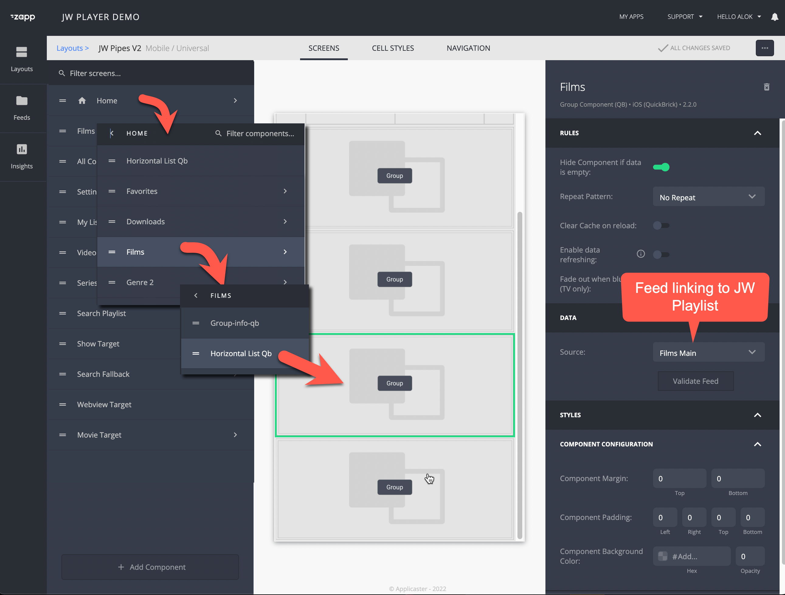

# Landing page
{: .no_toc }

- TOC
{:toc}

## Structure of a landing page

A video landing page is where a user lands after opening the application and contains a set of 'shelves': rows that highlight the most relevant videos for a user. A shelf typically contains 20-40 items. 

Example shelves:
- New in Drama
- Popular
- Scifi
- New releases

There are special shelves:
- Featured shelf: highlight special videos, typically manually curated and visualized at the top of the homepage
- Favorite shelf: a list of videos a user likes to watch in the future
- Continue watching shelf:  a list of videos a user has not completed yet

## Adding shelves with videos from JW Player
You can add shelves with components in Applicaster Zapp studio. The contents of a shelf are coming from a JW Playlist.

Steps in more detail: 
1. Create a JW playlist containing the items you want to show in the shelf.  
1. Register the playlist as a feed in Applicaster. See [here](https://docs.applicaster.com/integrations/jw-endpoints)
1. Create a group in Zapp Studio
1. Assign the feed as the data source to the group
1. Add a title header using the group info component. The title will come JW Playlist playlist name
1. Place a horizontal list inside the group component.

Tips
- It is possible to override the JW Player Playlist title using a URL parameter feedTitle. E.g.`feedTitle=Popular Drama`

## Popular videos shelf 
To add the most popular content in the beginning of the row, make sure to use a [dynamic playlist](https://support.jwplayer.com/articles/create-a-dynamic-playlist) which is sorted on 'Most played first".

## Newly published shelf
To add the new content at the beginning of the row, make sure to use a [dynamic playlist](https://support.jwplayer.com/articles/create-a-dynamic-playlist) which is sorted on 'Most recently published".

<!--
Because you watched' shelf
Grab the most recently completed movie and put its MediaID in the Related videos feed.-->

## Favorites shelf 
See [Applicaster documentation](https://docs.applicaster.com/using-zapp/favourites)

Note that syncing favorites and favorites across devices is not supported. 

## Continue watching shelf 
See [Applicaster documentation](https://docs.applicaster.com/using-zapp/continue-watching)

## Sync favorites and continue watching across devices
Requires client to support cloud events via 3rd party like cognito/okta/cleeng. See https://docs.applicaster.com/integrations/cloud-events/
