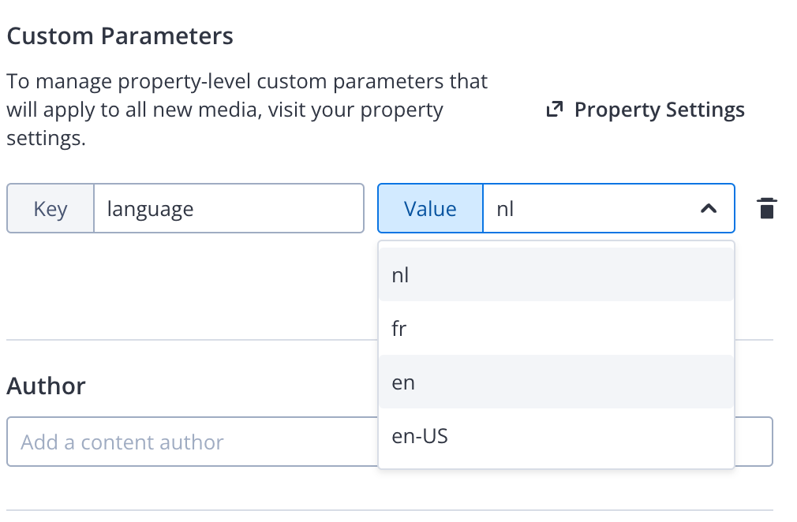

# Language
{: .no_toc}

- TOC
{:toc}

## Language handling
There are two ways of handling different language
1. Subtitles and alternate audio tracks on the video
2. Language specific videos

## Adding subtitles and alternate audio tracks
See JW documentation

## Language specific videos

**This is NOT yet available.**

A language tag, also known as the 'locale', consists of a 2-3 letter base language tag that indicates a language, optionally followed by the country or regions variant by '-', e.g. 'en-US' or 'fr-CA'. 

1. Add the Applicaster DI Plugin to your project
1. Add an [ISO 2 letter language  code]() to the media items in JW Player media items 

The system will filter the feed/playlist on the language

### Alternative 1 Tag based
Applicaster will filter the feed/playlist on tags according to format `lang:{country code}`
- the base language the operating system, e.g `lang:en`
- the regions variant of the operating system, e.g `lang:en-US`
- the regions variant of the operating system, e.g `lang:all`

### Alternative 2 Parameter based
Applicaster will filter the feed/playlist on field `language`
- the base language the operating system, e.g `lang:en`
- the regions variant of the operating system, e.g `lang:en-US`
- the regions variant of the operating system, e.g `lang:all`

Note:
- Benefits of parameters: we can use a lookup field of possible valuales 
- This is different from the GEO solution. However we want to move to the [JW native geo solution](https://support.jwplayer.com/articles/set-geoblocking-rules-for-videos) in Q4

Todo: check language codes and formatting
- Roku: ISO 639-2 Code and `_` as divider. E.g. `en_US`
- Apple: ISO 639-2 Code and `_` as divider. E.g. `en-US`
- Android: ...

