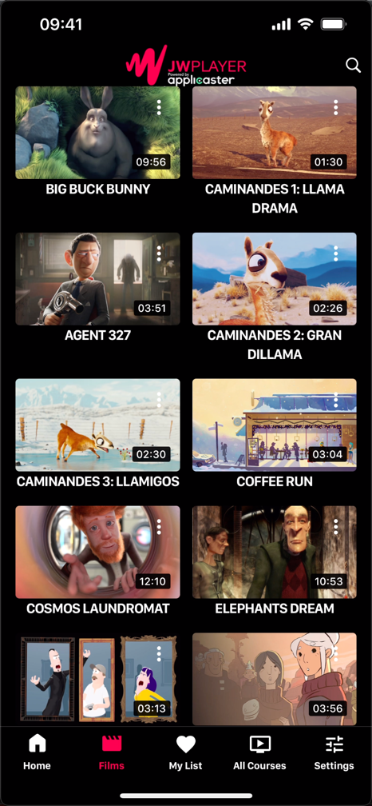
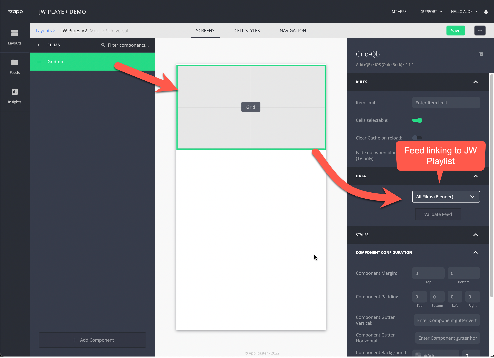

# Libraries
{: .no_toc}

- TOC
{:toc}

## What is a library screen?

A library allows viewers to browse all videos.

The standard usage is: 
- Have a library per format e.g  ‘movies’, ‘shorts’, ‘shows’
- About 50-500 items per library
- 5-20 genre filters e.g ‘action’, ‘drama’, ‘comedy’

## Develop a library screen

This behavior can be created as follows: 
1. Create a JW playlist containing the items you want to show in the library. 
1. Register the playlist as a feed-in Applicaster. See [here](https://docs.applicaster.com/integrations/jw-endpoints)
1. Create a group in Zapp Studio
1. Assign the feed as the data source to the group
1. Place a grid component inside the screen

 <!-- ## Filtering on genres 
By creating a genre screen. -->
