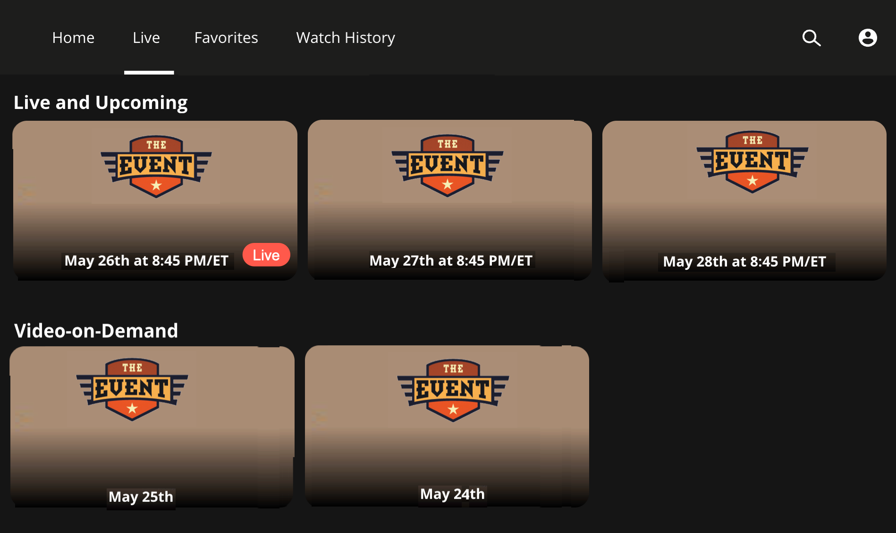
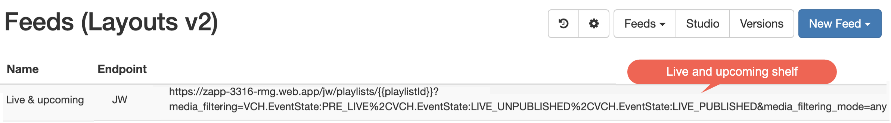
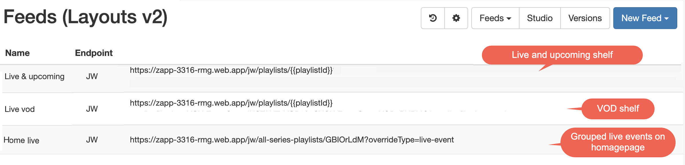
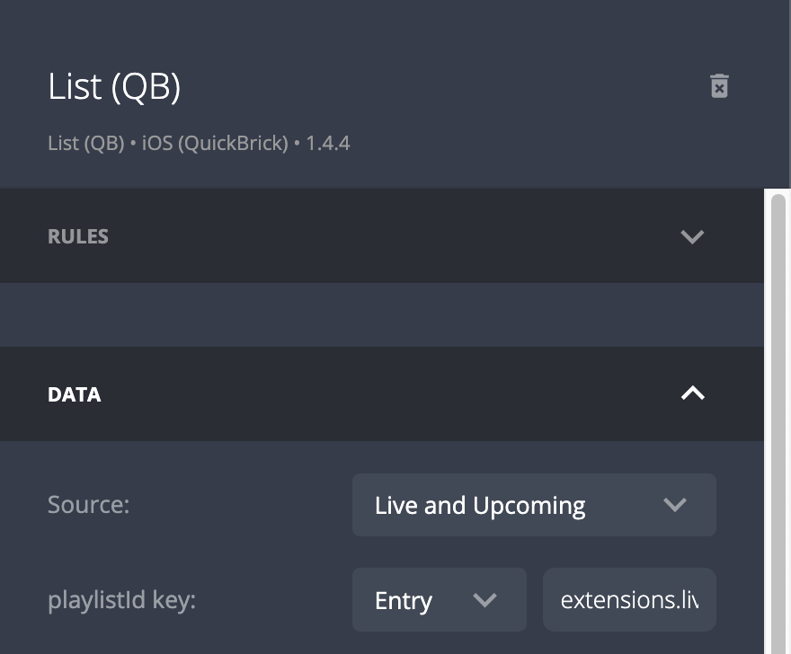
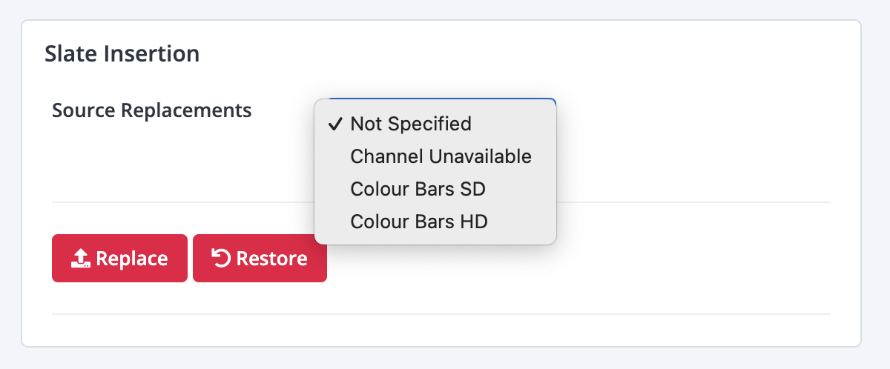

# Broadcast Live Events
{:.no_toc}

- TOC
{:toc}

## Introduction
JW Player offers different types of live services:
- Broadcast Live 24x7
- Broadcast Live Events
- Instant Live 

This article describes how to implement Broadcast Live Events with Applicaster Zapp. The article describes how to build 
- a shelf with *live and upcoming* items
- a shelf with historical streams: *video on demand*
- a page that groups multiple events streams on a single page

And takes into account transitioning feeds from upcoming to live to vod

<div style="display:flex; justify-content: center;"> 
   
</div>

## Events as media in JW Player
Broadcast Live Events are available as media items in the JW Dashboard. Those media items can be grouped into JW Player playlists, and these playlists can be registered as feeds in Applicaster. 

Broadcast Live will automatically add and update the media items with custom fields in JW Player. Manually added fields do not get overwritten by Broadcast Live. 

The important fields are
- `VCH.EventState`, which goes through the following states:
  1. `PRE_LIVE`
  2. `LIVE_UNPUBLISHED` 
  3. `LIVE_PUBLISHED` 
  4. `INSTANT_VOD` 
  5. `VOD_PUBLIC`
- `VCH.ScheduledStart` and `VCH.ScheduledEnd`. These follow the [ISO 8601 format](https://en.wikipedia.org/wiki/ISO_8601O). 

<div style="display:flex; justify-content: center;"> 
  
</div>


## Event media types in Zapp
Zapp assigns a video type based on the fields. It takes a few minutes before changes to media item fields are available in Applicaster apps due to caching. Applicaster Zapp also uses `VCH.ScheduledStart` and `VCH.ScheduledEnd` to determine when an event is live. 

| Zapp Video Type | Conditions | Comments |  
| ------ | ------ | ------ |
| `live-future` | `VCH.ScheduledStart` is in the future  |  Link to a landing page WITHOUT a player |      
| `live-now` | (`VCH.ScheduledStart`is in the past <br> AND`VCH.ScheduledEnd`in the future)  <br> OR `VCH.EventState` is `LIVE_PUBLISHED`  | Link to a landingpage WITH a player |     
| `live-vod` | `VCH.EventState` is `INSTANT_VOD` or `VOD_PUBLIC` |  Link to a landing page WITH a player  |   

<div style="display:flex; justify-content: center;"> 
   
</div>

## Create a live and upcoming shelf
1. Create a dynamic JW Player playlist that contains your live events. NOTE: A manual playlist cannot be used for this purpose
2. Create a feed in Applicaster, and filter it on PRE_LIVE, LIVE_UNPUBLISHED and LIVE_PUBLISHED using [media_filtering](https://developer.jwplayer.com/jwplayer/reference/get_v2-playlists-playlist-id-1):
```
?media_filtering=VCH.EventState:PRE_LIVE%2CVCH.EventState:LIVE_UNPUBLISHED%2CVCH.EventState:LIVE_PUBLISHED&media_filtering_mode=any
```
3. Add a list component in Applicaster and link it to the newly created feed
4. Set autorefresh on 60 seconds to deal with VCH.EventState changes
5. Ensure the videos with type `live-future` link to a [target screen](https://jwplayer.github.io/applicaster-docs/target-screens.html) *WITHOUT a player*
6. Ensure the videos with type `live-now` link to a [target screen](https://jwplayer.github.io/applicaster-docs/target-screens.html) *WITH a player*

<div style="display:flex; justify-content: center;"> 
   
</div>
<br><br>
<div style="display:flex; justify-content: center;"> 
   
</div>

## Create a video-on-demand shelf

Live events will automatically become VOD streams in Broadcast Live 
1. Create a playlist in JW Player that contain your live events. NOTE: A manual playlist cannot be used for this purpose
1. Create a feed in Applicaster, and filter it `INSTANT_VOD` or `VOD_PUBLIC`  using [media_filtering](https://developer.jwplayer.com/jwplayer/reference/get_v2-playlists-playlist-id-1):
```
?media_filtering=VCH.EventState:INSTANT_VOD%2CVCH.EventState:VOD_PUBLIC&media_filtering_mode=any
```
1. Add a list component in Applicaster and link it to the newly created feed
1. Set autorefresh on 60 seconds to deal with VCH.EventState changes
1. Ensure the videos with type `live-vod` link to a target screen *WITH a player*. See [here](https://jwplayer.github.io/applicaster-docs/target-screens.html)

<div style="display:flex; justify-content: center;"> 

</div>

## Creating an event page
1. Create a JW Player playlist representing the grouped live streams
1. Create a JW Player media item for the event to group the individual shows for an event together. 
  -  To create the dummy media item, upload a placeholder video into the JW Dashboard. For example, `http://foo.com/bar.mp4`. The actual URL is not important. Note: For DRM properties, you need a short (e.g., 1 second) video. 
  -  The title, thumbnail, and description set on this video will represent the event. 
  -  Add custom parameters that will contain the playlist ids. Prefered: `playlistId`
1. Ensure your Live and VOD feeds take the playlist id as input ` { {playlistId} }`
1. Assign the `playlistId` key to list components in Zapp. E.g. `extensions.playlistId`


<div style="display:flex; justify-content: center;"> 
   
</div>
<br>
<br>
<div style="display:flex; justify-content: center;"> 

</div>
<br>
<br>
<div style="display:flex; justify-content: center;"> 

</div>

## Assigning a live now badge 
Note: this will become available soon.

Broacast live events have a true/false field called `extensions.isLive` which can be used to assign a 'live lock badge'. This field is automatically assigned by Applicaster Zapp and will not appear in JW Player media item fields. 

## Combine live streams with other videos in a shelf
You might want to promote a live event together with other videos in single shelf. E.g. in a 'featured' shelf in the top of the homepage. 

You can achieve this by using`exclude_media_filtering` attribute instead of the `media_filtering` attribute. Example
```
?exclude_media_filtering=VCH.EventState:PRE_LIVE%2CVCH.EventState:LIVE_UNPUBLISHED%2CVCH.EventState:INSTANT_VOD%2CVCH.EventState:VOD_PUBLIC&exclude_media_filtering_mode=any
```
Ensure you handle the `live-now`, `live-future` and `live-vod` video types as described above.

## Handling delays and live stream issues
You want to inform viewers when the streams starts later or when you have an issue in the live stream. You can do this using a 'slate': an image stating something like "going live soon", "we are experiencing issues, stay tuned' . This can be configured in Broadcast Live using the API and the UI.

It will take about 30 seconds before the slates will be visible to the viewers. Please note that the images need to be uploaded before the stream starts.

<div style="display:flex; justify-content: center;"> 
   
</div>

The slate can also be updated using [the API](https://docs.vualto.com/projects/VIS/en/latest/events.html?highlight=slate#put-event-stream-replacesource-id)
```
PUT /event/stream/replacesource/{id}
{
  "sourceReplacementImage": "channel_unavailable.png"
}
```
Broadcast Live slates can be used in the Media Live and Media Excel Encoders. 
