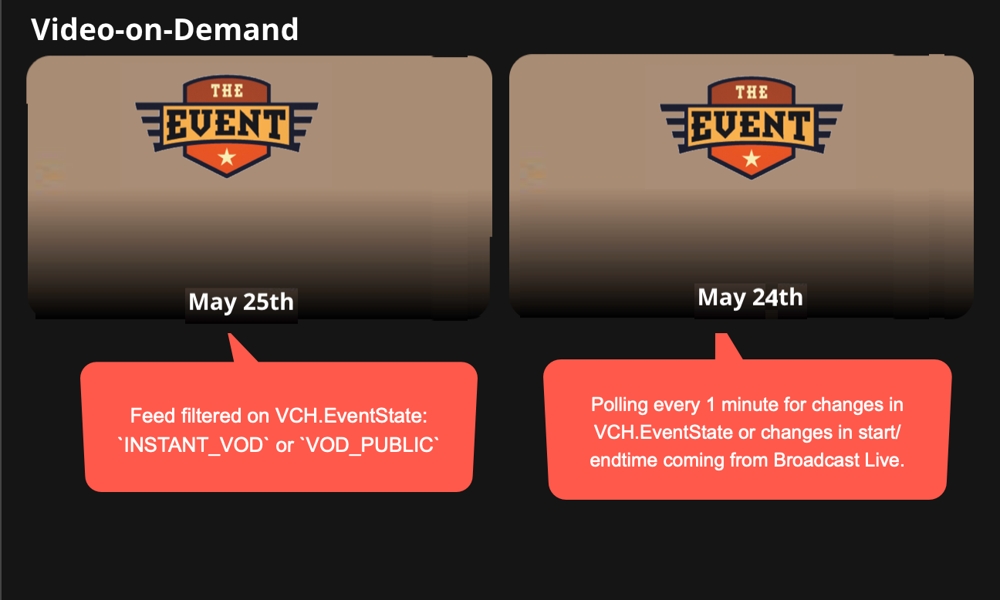
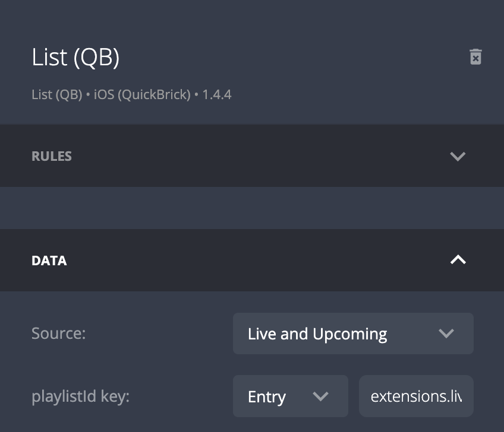

# Broadcast Live Events
{:.no_toc}

- TOC
{:toc}

## DISCLAIMER
This page explains functionality that is not fully developed and tested yet.

## Introduction
JW Player offers different types of live services:
- Broadcast Live 24x7
- Broadcast Live Events
- Instant Live 

This article describes how to implement Broadcast Live Events with Applicaster Zapp. 

<div style="display:flex; justify-content: center;"> 
   
</div>


## Events as media in JW Player
Broadcast Live Events are represented as media items in the JW Dashboard. Those media items can be grouped into JW Player playlists and these playlist can be registered as feed in Applicaster. 

Broadcast Live will automatically add and update the media items with custom fields in JW Player. Manually added fields will not get overwritten by Broadcast Live. 

The important fields are
- `VCH.EventState`, which goes through the following states:
  1. `PRE_LIVE`
  2. `LIVE_UNPUBLISHED` 
  3. `LIVE_PUBLISHED` 
  4. `INSTANT_VOD` 
  5. `VOD_PUBLIC`
- `VCH.ScheduledStart` and `VCH.ScheduledEnd`
  - These written in the [ISO 8601 format](https://en.wikipedia.org/wiki/ISO_8601O). 

<div style="display:flex; justify-content: center;"> 
  
</div>


## Event media types in Zapp
Zapp assigns a video type based on the fields. It takes a few minutes before changes to media items fields are availalbe in Applicaster apps due to caching. Applicaster Zapp therefore also uses `VCH.ScheduledStart` and `VCH.ScheduledEnd` to determine when an event is live. 

| Zapp Video Type | Conditions | Comments |  
| ------ | ------ | ------ |
| `live-future` | `VCH.ScheduledStart` is in the future  |  Link to a landing page WITHOUT a player |      
| `live` | (`VCH.ScheduledStart`is in the past <br> AND`VCH.ScheduledEnd`in the future)  <br> OR `VCH.EventState` is `LIVE_PUBLISHED`  | Link to a landingpage WITH a player |     
| `live-vod` | `VCH.EventState` is `INSTANT_VOD` or `VOD_PUBLIC` |  Link to a landing page WITH a player  |   

<div style="display:flex; justify-content: center;"> 
   
</div>

## Create a live and upcoming shelf

1. Create a playlist in JW Player that contain your live events 
2. Create a feed in Applicaster, and filter it on PRE_LIVE, LIVE_UNPUBLISHED and LIVE_PUBLISHED using [media_filtering](https://developer.jwplayer.com/jwplayer/reference/get_v2-playlists-playlist-id-1):
```?media_filtering=VCH.EventState:PRE_LIVE%2CVCH.EventState:LIVE_UNPUBLISHED%2CVCH.EventState:LIVE_PUBLISHED&media_filtering_mode=any```
3. Add a list component in Applicaster and link it to the newly created  feed
4. Set autorefresh on 60 seconds to deal with VCH.EventState changes
5. Ensure the videos with type `live-future` link to a [target screen](https://jwplayer.github.io/applicaster-docs/target-screens.html) *WITHOUT a player*
6. Ensure the videos with type `live-now` link to a [target screen](https://jwplayer.github.io/applicaster-docs/target-screens.html) *WITH a player*

<div style="display:flex; justify-content: center;"> 
   
</div>
<br><br>
<div style="display:flex; justify-content: center;"> 
   
</div>

## Create a video-on-demand shelf

Live events will automatically become VOD streams in Broadcast Live 
1. Create a playlist in JW Player that contain your live events
1. Create a feed in Applicaster, and filter it `INSTANT_VOD` or `VOD_PUBLIC`  using [media_filtering](https://developer.jwplayer.com/jwplayer/reference/get_v2-playlists-playlist-id-1):
```?media_filtering=VCH.EventState:PRE_LIVE%2CVCH.EventState:LIVE_UNPUBLISHED&media_filtering_mode=any```
1. Add a list component in Applicaster and link it to the newly created  feed
1. Set autorefresh on 60 seconds to deal with VCH.EventState changes
1. Ensure the videos with type `live-vod` link to a video landing page *WITH a player*. See here

<div style="display:flex; justify-content: center;"> 

</div>

## Creating an event page
1. Create a JW Player playlist representing the grouped live streams
1. Create a JW Player media item for the event to group the individual shows for an event together. 
  -  To create the dummy media item upload a placeholder video into the JW Dashboard. For example http://foo.com/bar.mp4. The actual URL is not important. For DRM properties, you need a short (e.g. 1 second) video. 
  -  The title, thumbnail, and description set on this video will represent the event. 
  -  Add custom parameters that will contain the playlist ids. E.g. `livePlaylistId` and `vodPlaylistId`
1. Assign the `playlistId` key to list components in Zapp. E.g. `extensions.livePlaylistId`

<div style="display:flex; justify-content: center;"> 

</div>
<br>
<br>
<div style="display:flex; justify-content: center;"> 

</div>

## Assigning a live now badge 
t.b.d.


##  Live and VOD items in a single list
Instead of using a `media_filtering` attribute, you use the `exclude_media_filtering` attribute. 
```
?exclude_media_filtering=VCH.EventState:PRE_LIVE%2CVCH.EventState:LIVE_UNPUBLISHED%2CVCH.EventState:INSTANT_VOD%2CVCH.EventState:VOD_PUBLIC&exclude_media_filtering_mode=any
```
Ensure you handle the `live-now`, `live-future` and `live-vod` video types as described above.
