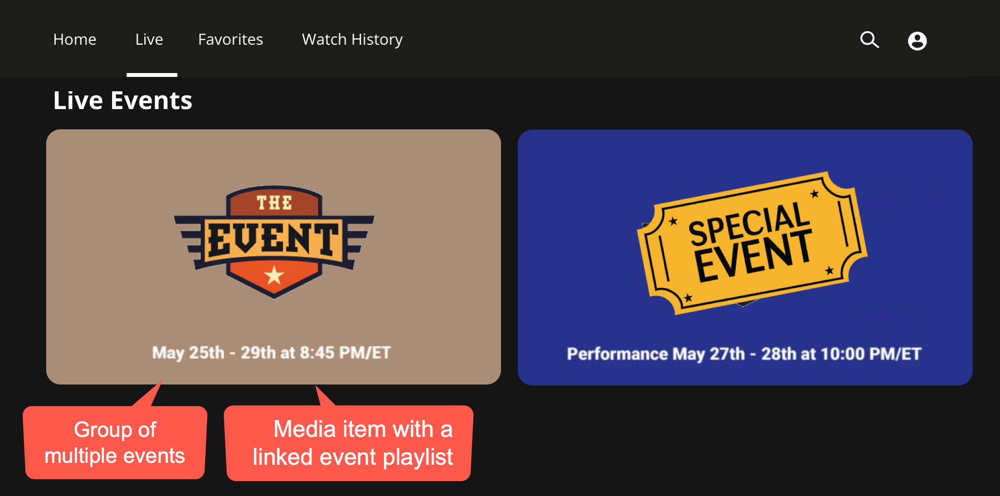

# Broadcast Live Events
{:.no_toc}

- TOC
{:toc}

## DISCLAIMER
This page explains functionality that is not fully developed and tested yet.

## Introduction
JW Player offers different types of live services:
- Broadcast Live 24x7
- Broadcast Live Events
- Instant Live 

This article describes how to implement Broadcast Live Events

## Broadcast Live Events in JW Player and Applicaster

Broadcast Live Events are represented as media items in the JW Dashboard. Those media items can be grouped into JW Player playlists and this can be registered as feed in Applicaster

Broadcast Live will automatically update the fields in JW Player. The following fields are important
- `VCH.EventState` goes through the following states:`PRE_LIVE` > `LIVE_UNPUBLISHED` > `LIVE_PUBLISHED` > `INSTANT_VOD` > `VOD_PUBLIC`
- `VCH.ScheduledStart` in ISO 8601 format
- `VCH.ScheduledEnd` in ISO 8601 format

Notes
- It takes a few minutes before updates propagate in Applicaster apps due to caching
- Other fields added to the JW Player Dashboard or MAPI will not get overwritten

## Create a live and upcoming shelf

1. Create a playlist in JW Player that contain your live events 
1. Create a feed in Applicaster, and filter it on PRE_LIVE, LIVE_UNPUBLISHED and LIVE_PUBLISHED using parameter`?media_filtering=VCH.EventState:PRE_LIVE%2CVCH.EventState:LIVE_UNPUBLISHED%2CVCH.EventState:LIVE_PUBLISHED&media_filtering_mode=any`
1. Add a list component in Applicaster and link it to the newly created  feed
1. Set autorefresh on 60 seconds to deal with VCH.EventState changes
1. Create a video landing page *without a player* and link it based on type live-future. See here
  - Videos streams get type `live` in Applicaster based on:  
    - The stream is live based on`VCH.ScheduledStart` and `VCH.ScheduledEnd`, this will ensure the stream will be playable
    - Or when the stream is live based on`VCH.EventState` is `LIVE_PUBLISHED`, to handle last-minute manual override of the scheduled time. 
1. Create a video landing page *WITH a player* and link it based on live-future. See here
   - Videos will get type `live-future` in Applicaster when it will starts in the future based on `VCH.ScheduledStart`

## Create a video-on-demand shelf of live events

Live events will automatically become VOD streams in Broadcast Live 
1. Create a playlist in JW Player that contain your live events
1. Create a feed in Applicaster, and filter it `INSTANT_VOD` or `VOD_PUBLIC`  using parameter `?media_filtering=VCH.EventState:PRE_LIVE%2CVCH.EventState:LIVE_UNPUBLISHED&media_filtering_mode=any`
1. Add a list component in Applicaster and link it to the newly created  feed
1. Set autorefresh on 60 seconds to deal with VCH.EventState changes
1. Create a video landing page *WITH a player* and link it based on live-future. See here
Video streams will get type `live-vod` in Applicaster based on:  
- The stream is live when its ended based on `VCH.ScheduledEnd`
- OR when VCH.EventState is `INSTANT_VOD` or ‘VOD_PUBLIC’, to handle last-minute manual override of the scheduled times 

## Grouping multiple live streams on a dedicated page

1. Create a playlist representing the grouped live streams
1. Create a media item for the event to group the individual shows for an event together. 
- This media item asset has no content, it will contain a thumbnail, metadata, and a reference to the playlist to display. 
  -  To create the dummy media item upload a placeholder video into the JW Dashboard. For example, you could enter http://foo.com/bar.mp4. The actual URL is not important. For DRM properties, you need a short (e.g. 1 second) video. 
  -  The title, thumbnail, and description set on this video will represent the event. 
  -  Add custom parameters that will contain the playlist id hosting the individual playlist.  
      - key: 'playlistId'
      - value: Id of the playlist, e.g. `0w1ITloK`
  
## Promoting live & VOD content in a single list
Instead of using a `media_filtering` attribute, you use the `exclude_media_filtering` attribute. 
`?exclude_media_filtering=VCH.EventState:PRE_LIVE%2CVCH.EventState:LIVE_UNPUBLISHED%2CVCH.EventState:INSTANT_VOD%2CVCH.EventState:VOD_PUBLIC&exclude_media_filtering_mode=any`

Ensure you handle the `live`, `live-future` and ‘live-vod’ video types as described above.
