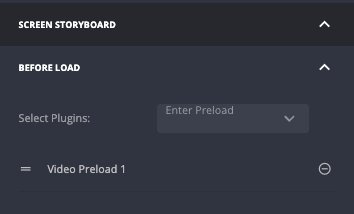

# Series
{: .no_toc}

- TOC
{:toc}

## Introduction
This page describes how to define and show series, with seasons and episodes.

## Define a series in JW (Using JWP Series Management)

### Create Series in JWP
- Create a series media asset in JW Player [JWP Add a Series](https://docs.jwplayer.com/platform/docs/add-a-series)
- Create a content type for episodes that is assigned to all episodes (example video-episode).  

### Create Feeds in Zapp
- series/series hero: `zapp-dsp-base-url/jw/series/[seriesId]` 
- seasons tabs: `zapp-dsp-base-url/jw/series/[seriesId]/seasons`
- episodes within a season: `zapp-dsp-base-url/jw/series/[seriesId]/seasons/[seasonId]/episodes`
  - seasonId= `extensions.season_number`

If you do not use seasons here is the feed format for all episodes:

- episodes within a series: `zapp-dsp-base-url/jw/series/[seriesId]/episodes`
   * seriesId= `id`

### Zapp setup
For the zapp set up of a series without tabs use a playlist with a series item that uses series management
Type mapping: `series` to connect to your series screen in zapp

For the zapp set up of a series with tabs use a playlist with a series item that user series management
Type mapping: `series` to connect to your tabs season screen in zapp
Type mapping: `season` to connect to the screen to display the episode list within a season tab
(Ask your Applicaster CSM how to create a tabbed series screen)

Finally you must create a new player screen for the episode content type (created in step the step above "Create Series in JWP"). This player must be configured with a "Video preload" configuration. This can be found in the player screen in Zapp under Screen Storyboard --> Before Load configuration:
player-pre-load-plugin 
 
THis before-load configuration tells the player to load the GET media API endpoint before playing the media asset (since the playback URL is not in the series management feed), This does introduce a small amount of additional load time when playing an episode asset. 

 
## Define a series in JW (Playlist based method)
You need:

- A 'series' playlist for each season that includes episodes for that season
- A contentType for new series that are NOT using series management. 
  * This contentType needs a set of custom parameters that let a user select the season playlists using: `"field_type": "playlist_select"` with the number of params equal to the maximum number of seasons being managed.
- A media item for each series with the contentType defined above 
- A playlist that contains all of the Series to be shown in a rail in tha app 
 
 The setup above will allow customers to create a new series as a media asset, name it, add a description, upload an image and then select the season playlists against the custom parameters. 

## Setup series in Zapp
Add a series of Feeds in Zapp
- One feed for the list of series: `zapp-dsp-base-url/jw/series/[playlistid]` 
- One dynamic feed to load the list of episodes from the playlists: `zapp-dsp-base-url/jw/playlist/{{seasonplaylistID}}`

In Zapp studio you then need the following rails/screens:
- A rail to show all series covers using the list of series playlist above. 
- A new **Series screen** to show the list of seasons and episodes. 
  * This screen has a large number of rails equal to the maximum amount of seasons that may need to be shown
  * Each rail is associated with the dynamic episode list feed above
  * {{seasonplaylistID}} can be set to the custom parameters defined in the new series contentType for example:
    + `extensions.season1`
    + `extensions.season2`
    + `extensions.season3`

  
ℹ️ it is highly recommended to utilise content types to make selection of the playlists easier. You can create fields that allow easy selection of the playlists. (see https://docs.jwplayer.com/platform/docs/add-a-content-type). If you have any questions around this please contact your JWP support/account team. 

