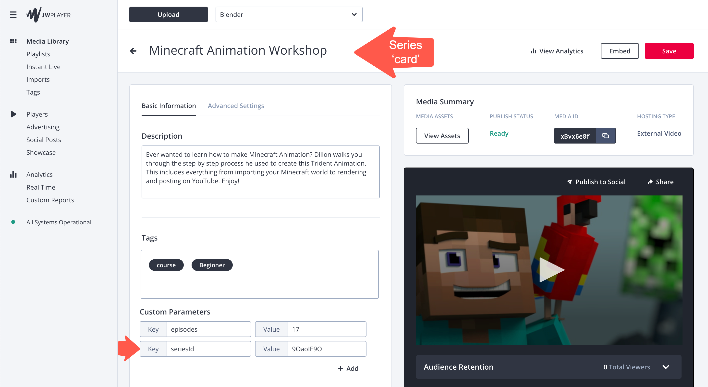
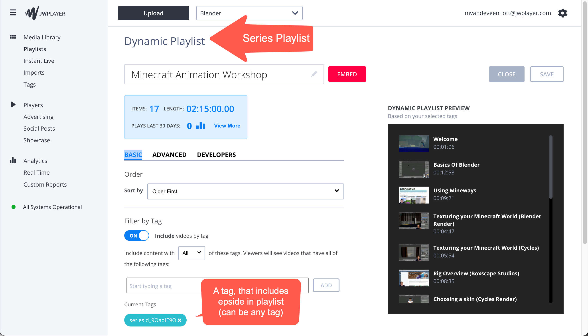
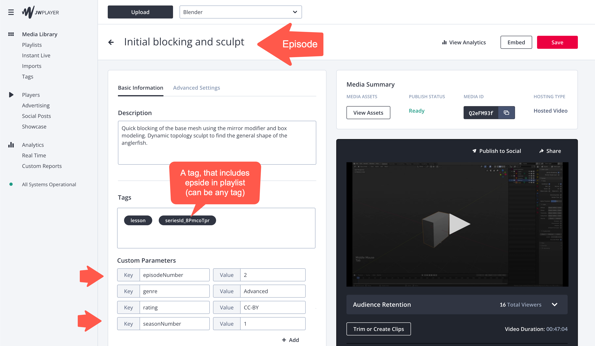
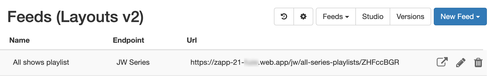
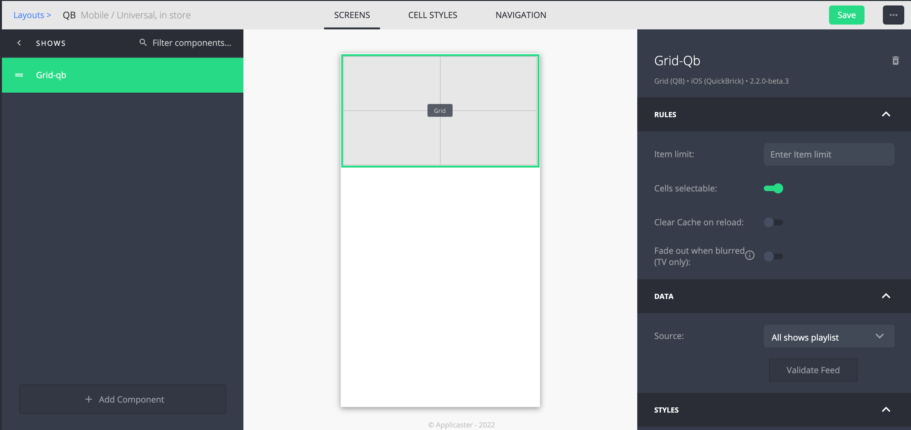
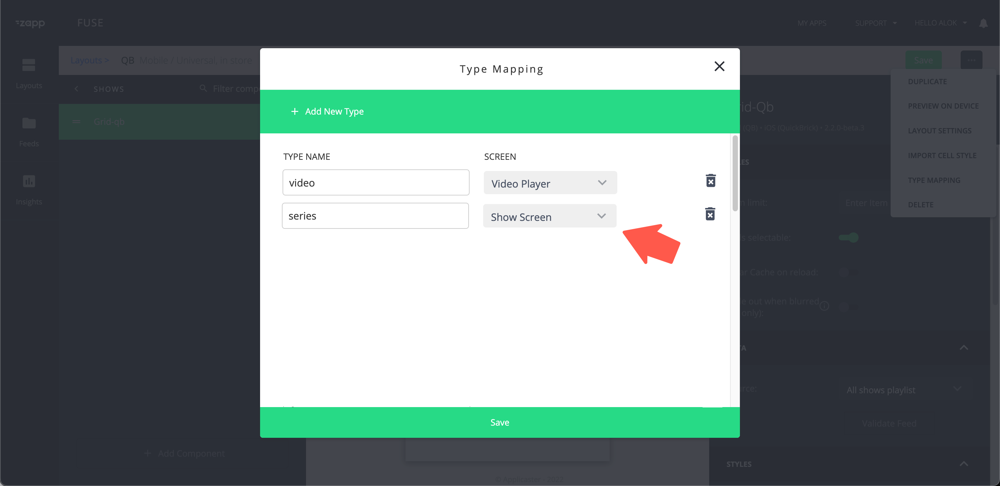
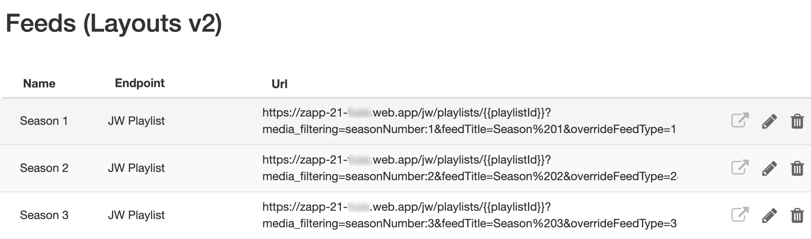
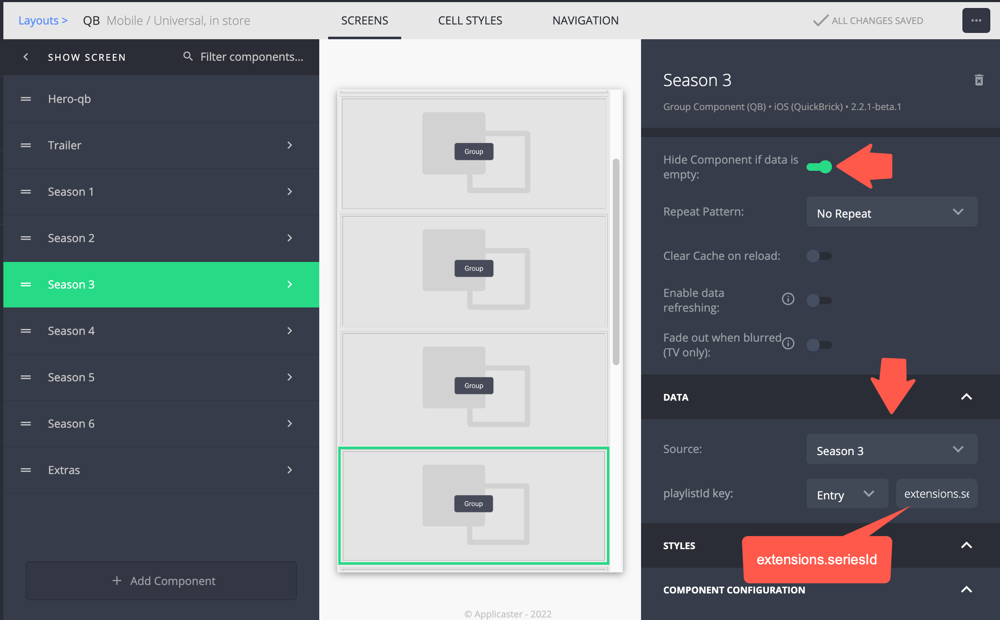

# Series
{: .no_toc}

- TOC
{:toc}

## Introduction
This page describes how to define and show series, with seasons and episodes.

The method describe here is compatible with the [JW Player OTT Web App](https://github.com/jwplayer/ott-web-app).

Notes
- A easier series management workflow is under development.
- The method described of is an improved version of what is described in the [Applicaster docs](https://docs.applicaster.com/integrations/jw-endpoints/#create-an-episodic-structure-using-jw-playlists)

## Define a series in JW 
You need:
- A media item (a.k.a. card) that links to the series playlist using `seriesId`
- A 'series' playlist that includes episodes based on a tag 
- Episodes with fields `episodeNumber` and `seasonNumber` and a tag, that includes the epsidoe in the in the series playlist

Detailed instructions for defining a series in JW can be found [here](https://support.jwplayer.com/articles/build-an-ott-apps-series-playlist). 

 
   

 

 
   

 

 
   

## Create an all series playlist in JW 
Create a playlist in JW Player, containing all the series. There are no special requirements

## Create an all series screen
1. Create a all series/shows feed using the middleware endpoint  `/jw/all-series-playlists/`. This endpoint will ensure the type to `series`
1. Create a series/shows screen pointing to the newly created feed
1. Do the type mapping to the [series target screen](https://jwplayer.github.io/applicaster-docs/target-screens.html)

 
   

 

 
   

 

 
   

## Create an series screen
1. Create an feed for all possible seasons in your enviroment. E.g seasons 4 looks like this:  `/jw/playlists/{{playlistId}}?media_filtering=seasonNumber:4&feedTitle=Season%204`
1. Create a series/show screen containing all possible seaons
1. Ensure to enable 'Hide Component if data is empty' 

 
   

 

 
   

