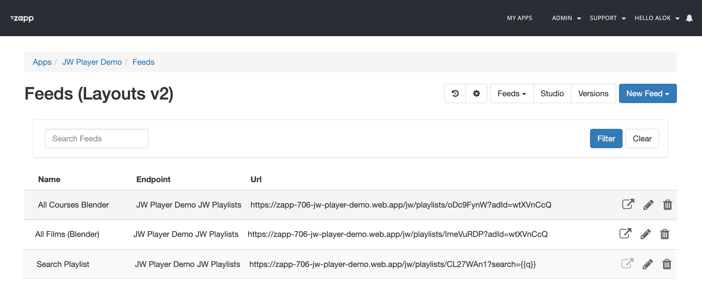

# Setup
{: .no_toc}

- TOC
{:toc}

## Intro
Follow the steps in this document to setup your JW Player - Applicaster environment. The first 3 steps require the help of a JW and/or Applicaster Customer Success representative. 

## 1. Create and register the JW Player Endpoint (required)
Applicaster needs to setup middleware (Firebase) for the communication between JW Player and Applicaster.  To setup the middleware: 
1. Retrieve the v1 API Credentials
   1. From your JW Player dashboard, click the gear next to your name > API Credentials.
   2. In the v1 API Credentials section, click SHOW CREDENTIALS next to a property name.
   3. Copy the `key` and the `Secret`.
2. Share them with the Applicaster Customer Success representative for the creation of the middleware in a secure way
3. Wait until you get the base URL back: e.g. `https://zapp-706-jw-player-demo.web.app`. 
4. Registering the URL as endpoint in Applicaster. See [here](https://docs.applicaster.com/integrations/jw-endpoints)

Note: If you need to connect multiple properties, individual end points need to be added for each of these properties. Each property has its own v1 API credentials. 

## 2. Enable the JW Analytics plugin (required)
- Provide Applicaster JW analytics token. Each platform can contain and report to only one analytics token
- See [analytics](https://marcovandeveen.github.io/jwp-applicaster-docs/analytics.html)

## 3. Enable captions for Samsung and LG (optional) 
The video players used in Samsung and LG are not compatible with they way JW Player exposes subtitles: these players expect the language attribute in the manifest. JW Player HLS streams expose only the the language name. As a result the viewwer will not be able to choose another subtitle.

The HLS streams need to be adjusted on property level. 

Ask your JW Player Account Manager or Solution Engineer to adjust this. (Internal JW PLayer Reference: [SERV-10412](https://jwplayer.atlassian.net/browse/SERV-10412))

## 4. Enabling Cleeng or another Subscribion Mgmt system (optional)
https://publisher.support.cleeng.com/hc/en-us/articles/4417301124252-Go-Live-Checklist 

## 5. Setup default metadata (advised)
The default metadata displayed from JW platform are the title of the video and description. Additional metadata like rating, genre, cast can be dfined as custom parameters.  A list of advised parameters can be found in the [field catalog](https://marcovandeveen.github.io/jwp-applicaster-docs/reference/field-catalog.html). Note that parameters are case sensitive.

These custom parameters can be pre-defined on a property level using the [default custom parameter configration](https://support.jwplayer.com/articles/manage-default-custom-parameters). These custom parameters automatically added to all new videos uploaded through your JW Player dashboard

## 6. Add videos to your JW library (advised)
See here [https://support.jwplayer.com/articles/add-videos-to-your-jw-player-library]
Make sure to assign the metadata to your videos

## 7. Create and register JW Playlist as feeds (advised)
1. Create a manual or dynamic playlist with the videos you want to make available in the Applicaster Apps. See [here](https://support.jwplayer.com/articles/create-a-playlist)
2. Register the playlist as a feed in Applicaster Zapp. See [here](https://docs.applicaster.com/integrations/jw-endpoints)

## 8. Register JW Playlist search playlist as feed (advised)
1. Create a search playlists in JW Player. See [here](https://support.jwplayer.com/articles/create-a-playlist)
2. Register the playlist as a feed in Applicaster Zapp. 

## 9. Link JW ad schedules to your feeds (advised)
1. [Create an ad schedule](https://support.jwplayer.com/articles/how-to-schedule-ad-breaks) in the JW Dashboard
2. Links it to yor feeds by adding `?adId={scheduleId)` to the URL 

<!-- pending:
- JW Watchlist ID - to lookup favorites and continue watching

Where can I learn how the app UI structure is built in front end:
Quick Brick app structure | Applicaster Docs 

https://docs.applicaster.com/using-zapp/qb-app-structure/. Requires the OTT Apps entitlement. 
--> 
