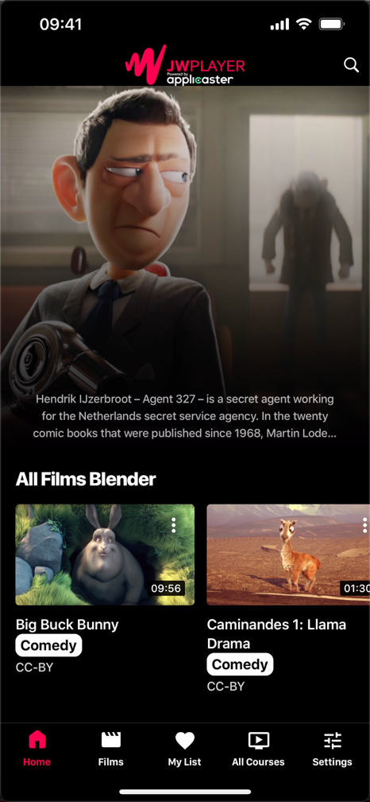

# Shelves
{: .no_toc }

1. TOC
{:toc}

 
## Shelves

The shelves are typically shown on the homepage. The standard usage is:
- shelves highlight the most relevant videos for a user
- shelves are visualized in rows of typically 20-40 items
- shelves have horizontal navigation
- shelves are sorted on popular or new content 'new action movies'

There are some special shelves:
- featured shelf: highlight special videos, manually curated and visualized in the top of the homepage
- favorite shelf: a list of videos a user likes to watch in the future. See Watchlist
- continue watching shelf: a list of videos a user has not completed yet. See Watchlist

## Libraries
A library allows viewers to browse all videos. The standard usage is:

Different libraries per format e.g ‘movies’, ‘shorts’, ‘shows’
About 50-500 items per library
5-20 genre filters e.g ‘action’, ‘drama’, ‘comedy’

## Video publishing using playlists
Videos are published to shelves and libraries using playlists:

Playlist are managed through JW Dashboard
- For manual paylist the items and their sorting are determined manually
- For dynamic playlist items are added based on tags and sorted on most viewed, most recently published or alphabetically

## Images
Each media item has poster images:
- The static thumbnail is automatically taken from a frame of the video
- The motion thumbnail (mp4/no audio) that is automatically derived from the first 5 seconds of the video
- It’s possible to choose a custom thumbnail. The static thumbnail can be selected from the stills of the media item.
- It’s not possible to have no thumbnails.
- The static thumbnails are automatically resized to 320px-1920px widths, keeping the image ratio stable.
- The motion image is not used in the applicater

## Idan
