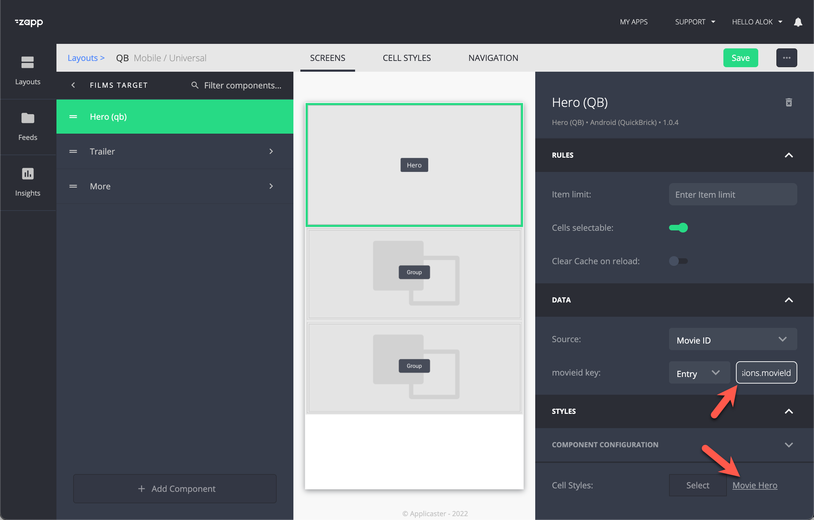
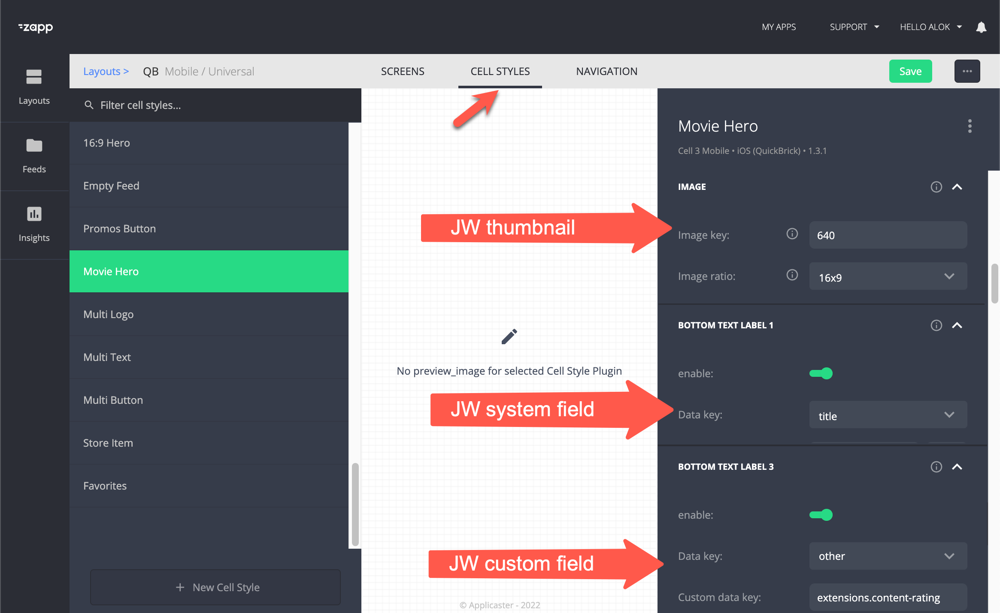

#  Target screens
{: .no_toc}

- TOC
{:toc}

## About target screens

A target screen is where the user lands after selecting a media item from a homepage, library or any other page.

Commonly used target screens:
- A movie target: that promotes a movie by giving the full details about the video, like a description, rating, duration, etc. 
- Series target. That shows the episodes of the series. 
- Player target. See [video playback](https://jwplayer.github.io/applicaster-docs/video-playback.html)

This article focuses on movie target screens. 

## Structure of a movie target screen
A typical movie target screen consists of:
1. An hero component that combines an image, texts and a call to action
1. A trailer
1. A related videos shelf

## Define movie metadata in JW Player
1. Make sure that you have all the meta data like MPAA Rating, Run Time, and other details that you want to show added as custom parameters in the JW platform.
2. Add `movieId` as a custom field within the media item in JW Player. See the [field catalog](https://jwplayer.github.io/applicaster-docs/reference/field-catalog.html)
3. Make sure you have `trailerId` as custom field in JW Player. See the [field catalog](https://jwplayer.github.io/applicaster-docs/reference/field-catalog.html)

Tip: Use [default custom parameters](https://support.jwplayer.com/articles/manage-default-custom-parameters). This automatically populates these values at the media level when the video gets uploaded and can be easily changed afterwards. 

## Define a movie screen as a 'target' 
1. A 'general content screen' 
1. Define it a 'target' for 'movies' using [type mapping](https://docs.applicaster.com/using-zapp/app-building-walk-through/#add-type-mapping)
1. Ensure the videos in your library and shelves `?overrideType=movie`

## Adding an hero component and link it with JW movie metadata 
1. Add a video [Hero Quick Brick (`Hero QB`)](https://docs.applicaster.com/using-zapp/qb-app-structure/#heroes) component to your video target page
1. Assign a 'single video' datascoure that is linked with the [media endpoint](https://developer.jwplayer.com/jwplayer/reference/media) of JW Player
1. Link the entry value: `extensions.movieId`. This will be used to get data from the datascource 
1  Select or create a [cell style](https://docs.applicaster.com/using-zapp/qb-app-structure/#cell-style). E.g.  'Mobile Cell 2' would have 2 labels to be assigned and is optimized for mobile phones. 
1. Link the cell.labels to values in JW Player by using the key `extensions.{custom-parameter-key}` 

## Add a trailer
1. Add a Group Component and UI components
1. Assign the datascoure that fetches a single video from JW Player
1. Insert the entry value: `extensions.trailerId`
1. Assign a [cell style](https://docs.applicaster.com/using-zapp/qb-app-structure/#cell-style) and save

<!--
## How to add a recommendations shelf?
. A recommendations / related videos shelf (group with group title and horizontal lists)
-->

## Defining multiple target screens
You can make multiple video target screens. E.g. a 'movie target' and a 'show target'. With [Type mapping](https://docs.applicaster.com/using-zapp/app-building-walk-through/#add-type-mapping) you can map a video type with a target screen.
