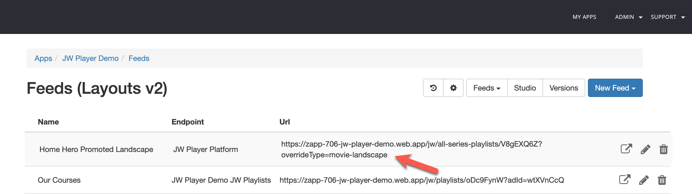

#  Type mapping
{: .no_toc}

- TOC
{:toc}

## About type mapping
Type mapping defines on which screen a viewer lands after selecting a video item from a landingpage, library or any other page.

Commonly used screens:
- A movie screen: that promotes a movie by giving the full details about the video, like a description, rating, duration, etc. 
- Series screen. That shows the episodes of the series. 
- Player screen. See [video playback](https://jwplayer.github.io/applicaster-docs/video-playback.html)

Each video in Zapp has a type. By default, a JWP media item will be mapped to type `video`

You can override this default on two levels:
- Media level, using custom parameter `contentType`
- Feed level, using `?overrideType=<zapp-video-type>`

## Find the Zapp video type
You can find the video type in your Zapp feed. See screenshot below

## Map a video type to a screen
You can define type mapping in Zapp Studio. See screenshot below and in [Applicaster Docs](https://docs.applicaster.com/using-zapp/app-building-walk-through/#add-type-mapping)

## Define the video type on a JWP media item
1. Add custom parameter 'contentType' 

Tip: Use [default custom parameters](https://docs.jwplayer.com/platform/docs/vdh-manage-default-custom-parameters). This automatically populates these values at the media level when the video gets uploaded and can be easily changed afterwards. 

## Define the video type on feed level
Add `?overrideType=<zapp-video-type>` to the feed URL. E.g. `?overrideType=movie`

Note: The feed-level overrides the media type level. 
