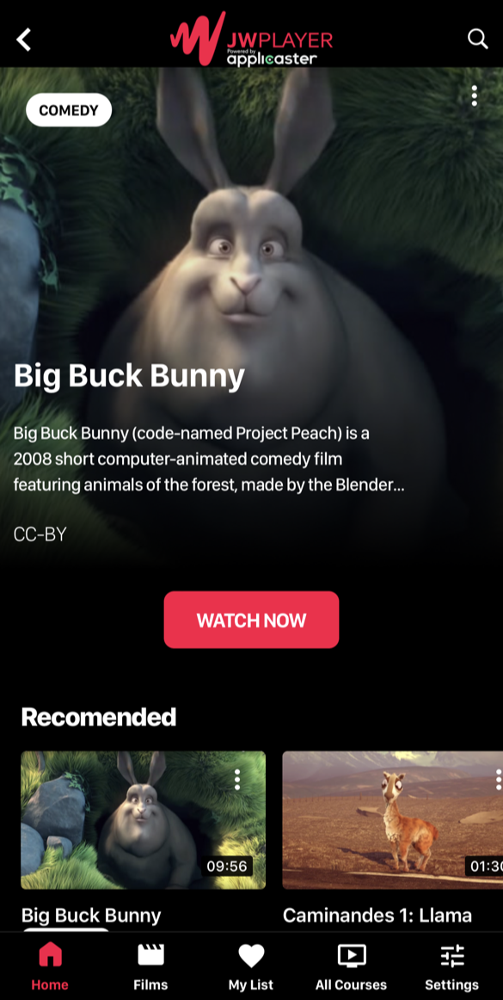
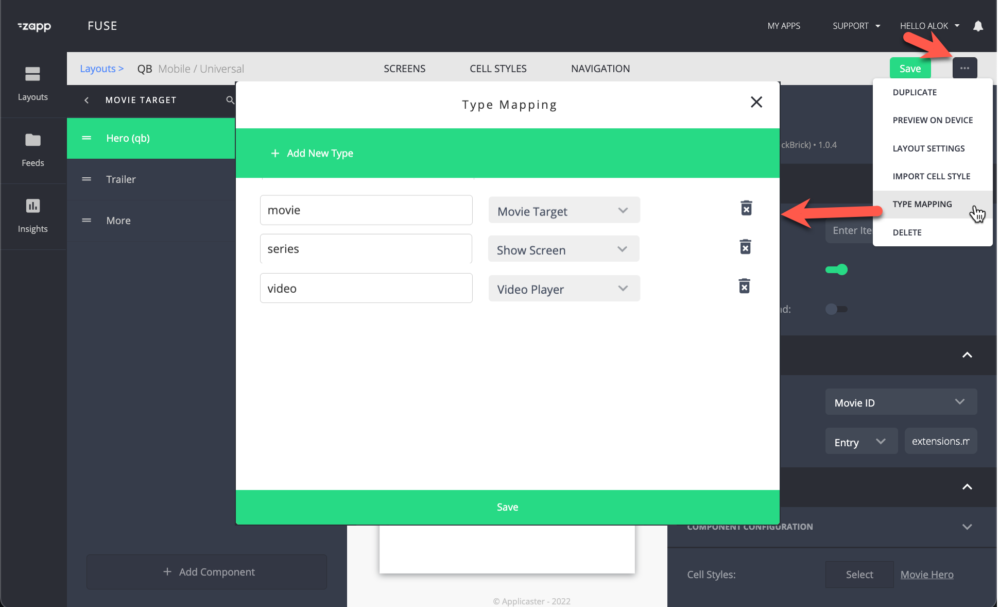

# Video playback 
{: .no_toc}

- TOC
{:toc}

## Player 'target' screen

A 'target' screen is where the user lands after selecting a video from a homepage or library.

Commonly used target screens:
- A movie target: that promotes a movie by giving the full details about the movie, like a description, rating, duration, etc. 
- Series target. 
- Player target. 

This article focuses on the player target screen 

## Define a player screen as target
1. Create a 'general content screen' 
1. Add player, and if needed a related videos shelf
1. Define it as a 'target' for 'video' using [type mapping](https://docs.applicaster.com/using-zapp/app-building-walk-through/#add-type-mapping)

By default, everytime a feed is set up in Applicaster, there has to be a value defined. Applicaster by default, defines this value as `Video` in the feeds that are returned from JW Platform. 

The 'type' value is used by Zapp to determine what screen is opened. When the value is 'video' the video player target screen is opened. 

## How to add subtitles / captions?
See JW Documentation on [adding closed captions](https://support.jwplayer.com/articles/how-to-add-closed-captions). Captions will automatically appear in Applicaster Apps. 

*Subitles on Samsung and LG*
- Samsung and LG using Shaka Player. Shakaplayer needs a two-letter code entere. Entering language code in the captions editor (`srclang` field in the API). See also [Update a text track developer documentation](https://developer.jwplayer.com/jwplayer/reference/patch_v2-sites-site-id-media-media-id-text-tracks-track-id-)
- Samsung and LG require in-manifest subtitles that need to be enabled on property level. See [Setup](https://jwplayer.github.io/applicaster-docs/setup.html#3-enable-captions-for-samsung-and-lg-optional)

## Enabling casting or airplay
This is available in Applicasters platform. See for more info [applicaster documenation](https://docs.applicaster.com/plugin-development/30-guides/50-plugins/50-player#properties). Search for chromecast or airplay.

*Airplay is enabled by default on iOS apps with no further setup. Chromecast, requires clients to provide a Chromecast app ID created here:
https://cast.google.com/publish/

## How to enable “Play Next”?
JW config: when a new JW endpoint is created, pipes2 enables play next feed by default.

Applicaster:
1. Add play next plugin on your mobile/TV platform in Zapp
1. Assign the correct image key from your media items based on size. See [images](https://jwplayer.github.io/applicaster-docs/)
1. Save and build the app for changes to appear

## Offline download
Requires a custom param on the item `hqme=true`

See [Applicaster docs](https://docs.applicaster.com/using-zapp/mobile/downloads/download-and-offline/)
