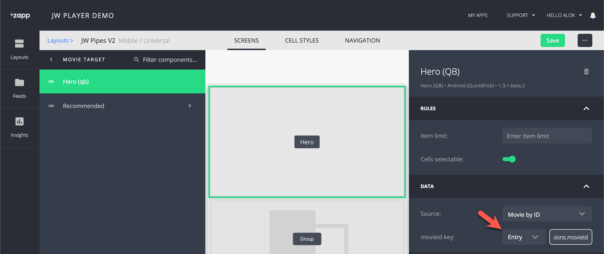

# Video target screen
{: .no_toc}

1. TOC
{:toc}

## What is a video target screen?
A video target screen is where the user lands after selecting a video from a shelf or library.

It promotes the video by giving he full details about the video, like a description, rating, duration, etc. 

A standard video target screen consist of
1. An hero component that combines an image, texts and calls to action
1. A 'view trailer' button
1. A related videos shelf

<!-- image here --> 

## Add a hero component with JW metadata
1. Add the video 'hero' component
1. Assign the datascoure that fetches single video from JW Player
1/ Insert the entry value: `extensions.movieId` This will be used to get data from the datascource 

Tip: Use [default custom parameters](https://support.jwplayer.com/articles/manage-default-custom-parameters). This automatically populates these values at the media level when the video gets uploaded and can be easily change afterwards. 

1. Add `movieId` as a custom field within the media item in JW Player. See the [field catalog](https://marcovandeveen.github.io/jwp-applicaster-docs/reference/field-catalog.html)

## Configing the 'hero' component 
1. Make sure that you have all the extra meta data like MPAA Rating, Run Time the other details that you want to show added as custom parameters in JW platform.
1. Add cell type. A 'Mobile Cell 2' would have 2 labels to be assigned and is optimized for mobile phones. 
1. Link the labels to values in JW Player by using the key `extensions.{custom-parameter-key}` 

## How to add trailers?
Make sure you have `trailerId` as custom field In JW Player. See the [field catalog](https://marcovandeveen.github.io/jwp-applicaster-docs/reference/field-catalog.html)

## How to add a recommendations shelf?
- A recommendations / related videos shelf (group with group title and horizontal lists

 
Applicaster:
1. Add a Group Component and correlating UI components
1. Assign the datascoure that fetches single video from JW Player
1. Insert the entry value: `extensions.trailerId`
1. Assign a cell style and save
