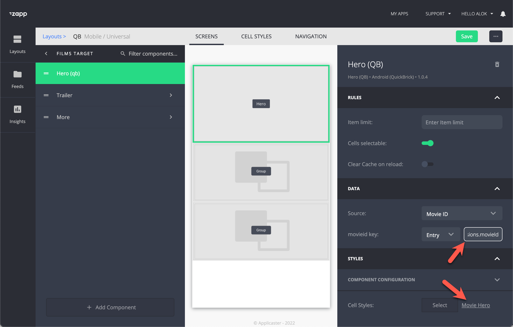

# Video target screen
{: .no_toc}

1. TOC
{:toc}

## Structure of a video target screen
A video target screen is where the user lands after selecting a video from a shelf or library. It promotes the video by giving he full details about the video, like a description, rating, duration, etc. 

A standard video target screen consist of
1. An hero component that combines an image, texts and a call to action
1. A trailer
1. A related videos shelf

<!-- image here --> 

## Defining your video metadata in JW Player
1. Make sure that you have all the extra meta data like MPAA Rating, Run Time the other details that you want to show added as custom parameters in JW platform.
2.  Add `movieId` as a custom field within the media item in JW Player. See the [field catalog](https://marcovandeveen.github.io/jwp-applicaster-docs/reference/field-catalog.html)
3.  Make sure you have `trailerId` as custom field In JW Player. See the [field catalog](https://marcovandeveen.github.io/jwp-applicaster-docs/reference/field-catalog.html)
Tip: Use [default custom parameters](https://support.jwplayer.com/articles/manage-default-custom-parameters). This automatically populates these values at the media level when the video gets uploaded and can be easily change afterwards. 

## Adding an hero component with JW Video
1. Add a video [Hero Quick Brick (`Hero QB`)](https://docs.applicaster.com/using-zapp/qb-app-structure/#heroes) component to your video target page
1. Assign a 'single video' datascoure that is linked witht the [media endpoint](https://developer.jwplayer.com/jwplayer/reference/media) of JW Player
1. Link the entry value: `extensions.movieId`. This will be used to get data from the datascource 
1  Select or create a [cell style](https://docs.applicaster.com/using-zapp/qb-app-structure/#cell-style). E.g.  'Mobile Cell 2' would have 2 labels to be assigned and is optimized for mobile phones. 
1. Link the cell.labels to values in JW Player by using the key `extensions.{custom-parameter-key}` 

## Add a trailer?
1. Add a Group Component and correlating UI components
1. Assign the datascoure that fetches single video from JW Player
1. Insert the entry value: `extensions.trailerId`
1. Assign a [cell style](https://docs.applicaster.com/using-zapp/qb-app-structure/#cell-style) and save

## How to add a recommendations shelf?
- A recommendations / related videos shelf (group with group title and horizontal lists)
